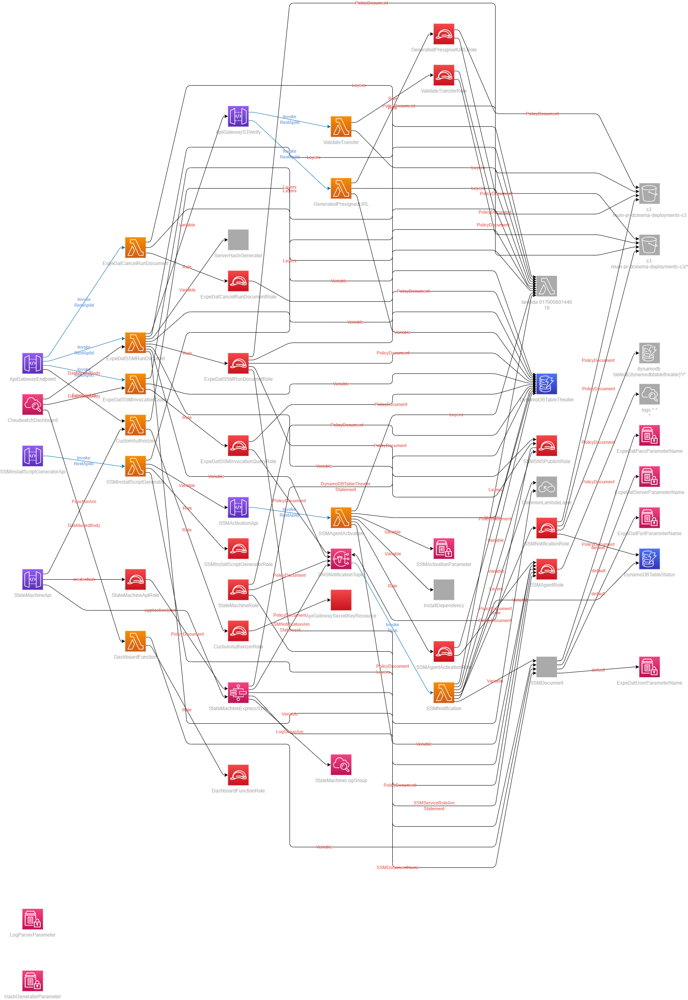
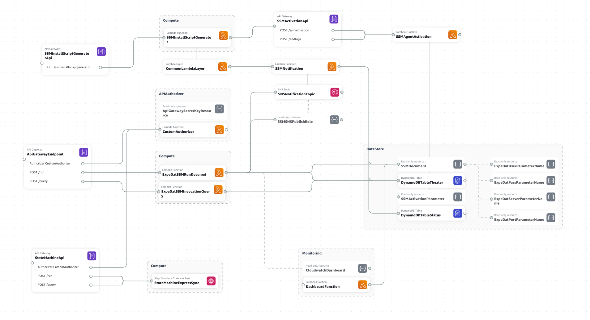

## Table of Contents

- [Introduction](#introduction)
- [Architecture](#architecture)
- [Directory Structure](#textcoloryellowtextdirectory-structure-aws-sam-template)
- [Deployment](#deployment)
- [Usage](#usage)

# Introduction

This repository contains an AWS SAM template and associated resources for deploying a serverless application that utilizes AWS Systems Manager (SSM) to manage servers and automate tasks.

# Digital Cinema Distribution


### Directory Structure AWS SAM Template

```


📦DCinemaCloudformation           ---> Root folder
 ┣ 📂functions                    ---> Lambda functions folder
 ┃ ┣ 📂CustomAuthorizer
 ┃ ┃ ┗ 📜index.py
 ┃ ┣ 📂DashboardFunction
 ┃ ┃ ┗ 📜index.py
 ┃ ┣ 📂ExpeDatSSMInvocationQuery
 ┃ ┃ ┣ 📜index.py
 ┃ ┃ ┗ 📜requirements.txt
 ┃ ┣ 📂ExpeDatSSMRunDocumet
 ┃ ┃ ┣ 📜index.py
 ┃ ┃ ┗ 📜requirements.txt
 ┃ ┣ 📂SSMAgentActivation
 ┃ ┃ ┣ 📜index.py
 ┃ ┃ ┗ 📜requirements.txt
 ┃ ┣ 📂SSMInstallScriptGenerator
 ┃ ┃ ┣ 📜index.py
 ┃ ┃ ┣ 📜requirements.txt
 ┃ ┃ ┗ 📜sample.py
 ┃ ┣ 📂SSMNotification
 ┃ ┃ ┣ 📂template
 ┃ ┃ ┃  ┣ 📂images
 ┃ ┃ ┃  ┃  ┣ 📜logo.png
 ┃ ┃ ┃  ┃   ┗ 📜header.png
 ┃ ┃ ┃  ┣ 📜email_template.html
 ┃ ┃ ┃  ┗ 📜email_template_success.html
 ┃ ┃ ┗ 📜index.py
 ┣ 📂lambdaLayer
 ┃ ┗ 📜requirements.txt           ---> Custom package requirements for Lambda Layer
 ┣ 📂qatesting
 ┃ ┣ 📜theater-box.yaml           ---> Sample Theater Box metadata file, can be modified as per requirement. Not used in the template. Only for testing using K8s.
 ┃ ┣ 📜expedat-server.yaml        ---> Sample expedat server metadata file, can be modified as per requirement. Not used in the template. Only for testing using K8s.
 ┣ 📂ssm_documents
 ┃ ┗ 📜ssmDocument.yaml           ---> Sample SSM Document to run ExpeDat file operation, can be modified as per requirement. Not used in the template.
 ┣ 📂statemachine                 ---> Step Function definition
 ┃ ┗ 📜ssm_run_query.asl.json
 ┃ ┗ 📜test.asl.json              ---> Sample Step Function definition, not used in the template.
 ┣ 📜.gitignore
 ┣ 📜README.md
 ┣ 📜samconfig.toml
 ┣ 📜template.drawio
 ┣ 📜template.svg
 ┗ 📜template.yml                 ---> Main SAM template having all the resources

```

# Architecture

The AWS SAM template deploys the following resources:

<details><summary>Resources</summary>

- An AWS API Gateway API that exposes the functions as RESTful endpoints and has a Custom Authroizer.
- An AWS API Gateway API that allows the SSM Agent installation script to be downloaded.
- An AWS API Gateway API that allows the SSM Agent activation script to fecth registration and store metadata as tags.
- An AWS Lambda function that is used as a Custom Authorizer for the API Gateway.
- An AWS Lambda function that queries SSM Command Invocation status about a specific server.
- An AWS Lambda function that runs a specified SSM document on a specific server.
- An AWS Lambda function that activates and tags the SSM Agent on a specific server.
- An AWS Lambda function that generates an installation script for the SSM Agent setup.
- An AWS Lambda function that queries SSM and sends data to Cloudwatch Dashboard.
- An AWS CloudWatch Dashboard that displays Lambda function and API Gateway metrics with SSM Invocation metrics.
- An Amazon DynamoDB table that stores the Theater metadata.
- An Amazon DynamoDB table that stores the JobID and status.
- An Amazon SNS topic that sends notifications when the status of Command invocation is changed.
- SSM Parameter Store parameters to store Expedat credentials and SSM Activation keys.
- Additional IAM roles and policies to allow the functions to access the required services.
- An AWS Step Function that orchestrates the SSM Run Command and SSM Invocation.(Optional during setup,does the same functionality as the Lambda function for query and run)
- An AWS API Gateway API invokes the Step Function.(Optional)

</details>



A more understandable architecture diagram can look like this:


# Deployment

Install the AWS CLI, AWS SAM CLI and configure your credentials.

Run the following command to package and build the template:

`sam build --profile admin --region ap-south-1`

Run the following command to deploy the stack:

`sam deploy --profile admin --region ap-south-1`

> **Note**
> : Replace the profile and region with your specific values and also replace the parameter values with your specific values during deployment.

# Usage

Once the stack is deployed, the output section of the CloudFormation stack will contain the API endpoint. And the download link for the SSM Agent installation script.

```
-----------------------------------------------------------------------------------------------------------------------------------------------------
CloudFormation outputs from deployed stack
-----------------------------------------------------------------------------------------------------------------------------------------------------
Outputs
-----------------------------------------------------------------------------------------------------------------------------------------------------
Key                 SSMInstallScriptFile
Description         SSM Install Script file download link using SSMInstallScriptGeneratorApi
Value               https://xxxx7mr61.execute-api.ap-south-1.amazonaws.com/Prod/ssminstallscriptgenerator

Key                 SSMInvocationOutputApi
Description         SSM Invocation CommandID Output and Progress API
Value               https://xxxxmiq22.execute-api.ap-south-1.amazonaws.com/Prod/query

Key                 Dashboard
Description         Cloudwatch Dashboard
Value               https://ap-south-1.console.aws.amazon.com/cloudwatch/home?region=ap-south-1#dashboards:name=XXXXX-Dashboard

Key                 StateMachineApi
Description         State Machine API
Value               https://xxxxwjclg.execute-api.ap-south-1.amazonaws.com/Prod/run

Key                 SSMRunCommandApi
Description         SSM Run Command API to initiate Exepdat file operation
Value               https://xxxxfmiq22.execute-api.ap-south-1.amazonaws.com/Prod/run
------------------------------------------------------------------------------------------------------------------------------------------------------

Successfully created/updated stack - DCinemaAWS in ap-south-1

```

# Documentation

Use the following links to learn more about the AWS services used in this template:

- [AWS SAM](https://docs.aws.amazon.com/serverless-application-model/latest/developerguide/what-is-sam.html)
- [AWS Lambda](https://docs.aws.amazon.com/lambda/latest/dg/welcome.html)
- [AWS API Gateway](https://docs.aws.amazon.com/apigateway/latest/developerguide/welcome.html)
- [AWS Step Functions](https://docs.aws.amazon.com/step-functions/latest/dg/welcome.html)
- [AWS CloudWatch](https://docs.aws.amazon.com/AmazonCloudWatch/latest/monitoring/WhatIsCloudWatch.html)
- [AWS SNS](https://docs.aws.amazon.com/sns/latest/dg/welcome.html)
- [AWS SSM](https://docs.aws.amazon.com/systems-manager/latest/userguide/what-is-systems-manager.html)
- [AWS DynamoDB](https://docs.aws.amazon.com/amazondynamodb/latest/developerguide/Introduction.html)

Sphinx documentation is available at [docs](docs/_build/html/index.html) as html and pdf format at [docs](docs/build/latex/dcinemadistributionawsresources.pdf) folder.

&#10002; Happy Coding!
